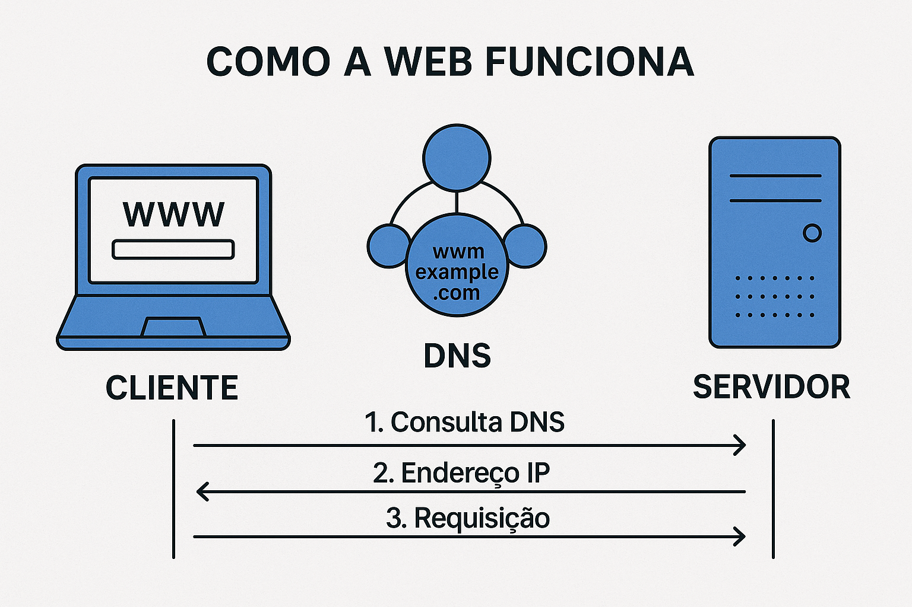

# Programação Web :mortar_board:
## Desenvolvimento de aplicações Web (Part. 1)

--- 

Desenvolvimento de aplicações Web (Part. 1)
## Internet e Web

---

## O que é a Internet? 

A Internet é a **infraestrutura lógica e física** global.

* **Rede de Redes:** Bilhões de dispositivos interconectados (roteadores, switches, fibra, satélites).
* **Protocolo Base:** Opera sobre a suíte **TCP/IP**, garantindo que os pacotes de dados cheguem ao destino correto.
* **Versatilidade:** É a "rodovia" que suporta diversos serviços:
    * E-mail (SMTP), Transferência de Arquivos (FTP), Streaming e a **Web**.

> **Nota:** A Internet é a infraestrutura; a Web é um dos serviços que corre sobre ela.

---

## O que é a Web (World Wide Web)?

A Web é um **sistema de informações** que utiliza a Internet como meio de transporte.

* **Documentos Interligados:** Baseia-se no conceito de **Hipertexto** (links que conectam páginas).
* **A Tríade Fundamental:**
    1.  **HTML:** A estrutura e conteúdo.
    2.  **HTTP/HTTPS:** O protocolo que define como as mensagens são formatadas e transmitidas.
    3.  **URL/URI:** O sistema de endereçamento único global.

---

## Qual a origem da Web?

* **O Criador:** Sir **Tim Berners-Lee** (1989).
* **O Local:** **CERN** (Suíça) – Necessidade de compartilhar dados complexos entre pesquisadores.
* **O Marco:** Lançada publicamente em 1991 como uma tecnologia **royalty-free** (gratuita e aberta), o que permitiu sua expansão global.
* **O Primeiro Endereço:** [https://info.cern.ch/](https://info.cern.ch/)

---

## Como a Web Funciona? (Arquitetura Cliente-Servidor)

A Web opera em um ciclo de **Requisição e Resposta**.

* **Clientes (Clients):** Navegadores (Chrome, Firefox) rodando em dispositivos do usuário. Eles "pedem" recursos.
* **Servidores (Servers):** Computadores de alta performance que "escutam" pedidos e entregam arquivos (HTML, CSS, JS) ou processam dados.

---

---

## Os Componentes da Comunicação

Para que uma página chegue até você, quatro pilares trabalham juntos:

1.  **TCP/IP:** Define como os dados são fragmentados em pacotes e endereçados.
2.  **DNS (Domain Name System):** O "catálogo" da Web. Traduz `www.fatec.sp.gov.br` em um endereço IP (ex: `192.0.2.1`).
3.  **HTTP (Hypertext Transfer Protocol):** A linguagem de conversação. O cliente diz `GET /index.html` e o servidor responde com o conteúdo.
4.  **Arquivos de Componentes:** O resultado final é a composição de ativos (HTML, CSS, JS, Imagens e APIs).

---

## O Ciclo de Vida de uma Acesso Web

1.  O usuário digita a URL no navegador.
2.  O navegador consulta o **DNS** para achar o IP do servidor.
3.  O navegador abre uma conexão **TCP** e envia uma **Requisição HTTP**.
4.  O servidor processa e envia uma **Resposta HTTP** (ex: Status 200 OK).
5.  O navegador recebe os arquivos e realiza o **Rendering** (montagem visual da página).

--- 

Desenvolvimento de aplicações Web (Part. 1)
## Hands on

---

## DevTools

- [https://developer.chrome.com/docs/devtools?hl=pt-br](https://developer.chrome.com/docs/devtools?hl=pt-br)

---

## DevTools

- Elementos
- Console
- Fontes
- Rede

---

## DevTools

- Desempenho
- Memória
- Aplication
- Privacidade e segurança
- Lighthouse

---

Desenvolvimento de aplicações Web (Part. 1)
## Considerações sobre o Desenvolvimento de Aplicações Web

---

Considerações sobre o Desenvolvimento de Aplicações Web
## Arquitetura e Design

---

## Padrões Estruturais

A escolha arquitetural define os limites de escalabilidade e a complexidade de manutenção do sistema.

### Monolito vs. Microsserviços
* **Monolito Modular:** Código único, deploy único. *Vantagens:* Simplicidade inicial, debug fácil, latência zero entre módulos. *Desvantagens:* Acoplamento alto, falha única (SPOF), stack tecnológica travada.
* **Microsserviços:** Domínios de negócio isolados. *Vantagens:* Escala independente, times autônomos, poliglota. *Desvantagens:* Complexidade operacional (orquestração), consistência eventual, latência de rede.

---

## Padrões Estruturais

A escolha arquitetural define os limites de escalabilidade e a complexidade de manutenção do sistema.

### Padrões de Comunicação
* **Síncrono (Request/Response):** REST (JSON over HTTP), gRPC (Protobuf over HTTP/2). Bloqueia o chamador até a resposta.
* **Assíncrono (Event-Driven):** O produtor emite um evento sem saber quem vai consumir. Desacopla serviços e aumenta a resiliência.

---

## APIs e Integração

Como os serviços conversam entre si e com o mundo exterior.

* **API Gateway:** Ponto único de entrada. Gerencia autenticação, rate limiting, cache e roteamento. Oculta a complexidade dos microsserviços.
* **BFF (Backend for Frontend):** Criação de APIs específicas para cada cliente (Mobile, Web, IoT) para evitar *over-fetching* ou *under-fetching* de dados.

---

## APIs e Integração

### Tecnologias de Interface
* **REST:** Padrão de mercado, stateless, cacheável.
* **GraphQL:** Permite ao cliente pedir exatamente os campos que precisa. Resolve o problema de múltiplas requisições (N+1 problem no frontend).
* **gRPC:** Ideal para comunicação interna (servidor-servidor). Alta performance, contratos tipados, streaming bidirecional.

---

Considerações sobre o Desenvolvimento de Aplicações Web
## Arquitetura Stateless

---

## Arquitetura Stateless (Sem estado)

O fundamento da escalabilidade horizontal na Web.

* **Conceito:** O servidor não retém informações sobre o estado da sessão do cliente entre requisições. Cada Request HTTP deve conter toda a informação necessária para ser processado.
* **Por que é crucial?** Permite que qualquer instância do servidor atenda qualquer requisição. Se um servidor cair, o usuário não é desconectado.

---

## Arquitetura Stateless (Sem estado)

### Gerenciamento de Estado
1.  **Client-Side (Tokens):** O estado viaja criptografado no **JWT (JSON Web Token)**. O servidor apenas valida a assinatura.
2.  **Server-Side Distribuído:** O identificador de sessão fica no cookie, mas os dados estão em um **banco de memória rápido e centralizado** (Redis/Memcached), acessível por todos os servidores.

---

Considerações sobre o Desenvolvimento de Aplicações Web
## Banco de Dados

---

## Estratégias e Escolhas

Não existe "bala de prata". A escolha depende da natureza dos dados.

### Teorema CAP
Em um sistema distribuído, você só pode ter 2 de 3:
1.  **C**onsistency (Consistência): Todos veem os mesmos dados ao mesmo tempo.
2.  **A**vailability (Disponibilidade): O sistema sempre responde (mesmo com dados antigos).
3.  **P**artition Tolerance (Tolerância a Partição): O sistema funciona mesmo se a rede falhar.

---

> *Na Web, geralmente sacrificamos a Consistência estrita em favor da Disponibilidade (Eventual Consistency).*

---

## Tipos de Bancos de Dados

* **Relacional (SQL):** (PostgreSQL, MySQL). ACID, esquemas rígidos, joins complexos. Ideal para: Financeiro, ERP, Cadastros principais.
* **NoSQL (Document):** (MongoDB). Esquema flexível (JSON). Ideal para: Catálogos, CMS, Dados não estruturados.
* **NoSQL (Key-Value):** (Redis, DynamoDB). Altíssima velocidade. Ideal para: Cache, Sessão, Carrinho de compras.

---

## Tipos de Bancos de Dados

* **NoSQL (Wide-Column):** (Cassandra). Escrita massiva. Ideal para: Logs, Time-series, IoT.
* **NoSQL (Graph):** (Neo4j). Relacionamentos complexos. Ideal para: Redes sociais, Recomendação.

---

## Escalabilidade de Dados

Como lidar quando o banco se torna o gargalo.

* **Replication (Master-Slave):** Uma instância de escrita (Master) e várias de leitura (Slaves). Aumenta a capacidade de leitura, mas introduz *delay* de replicação.
* **Sharding (Particionamento Horizontal):** Dividir os dados em múltiplos servidores baseados em uma *Shard Key* (ex: ID do Usuário).
    * *Desafio:* Queries complexas que cruzam shards são lentas/impossíveis.
* **Consistent Hashing:** Algoritmo usado para distribuir dados entre shards de forma a minimizar a movimentação de dados quando um nó é adicionado ou removido.

---

Desenvolvimento de aplicações Web (Part. 1)
## Referências

---

## Referências 

- https://developer.mozilla.org/pt-BR/docs/Learn_web_development/Getting_started/Web_standards/How_the_web_works

---

# Obrigado :metal:

---

## Eduardo Cruz Araujo

- E-mail: [eduardo.araujo28@fatec.sp.gov.br](eduardo.araujo28@fatec.sp.gov.br)
- Instagram: [edcaraujo](https://www.linkedin.com/in/edcaraujo/)
- Linkedin: [edcaraujo](https://www.instagram.com/)
- Github: [edcaraujo](https://github.com/edcaraujo)